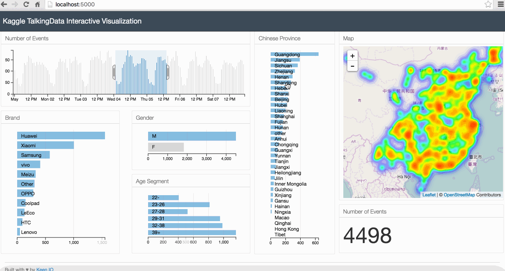

#Dependencies

You need ```Python``` 2.7.x and 3 ```Python``` libraries: ```Pandas```, ```Flask```, ```Shapely```.

The easiest way to install ```Pandas``` is to install it as part of the [Anaconda distribution](https://www.continuum.io/downloads).

You can install ```Flask``` and ```Shapely``` using ```pip```.

```
pip install flask shapely
```

